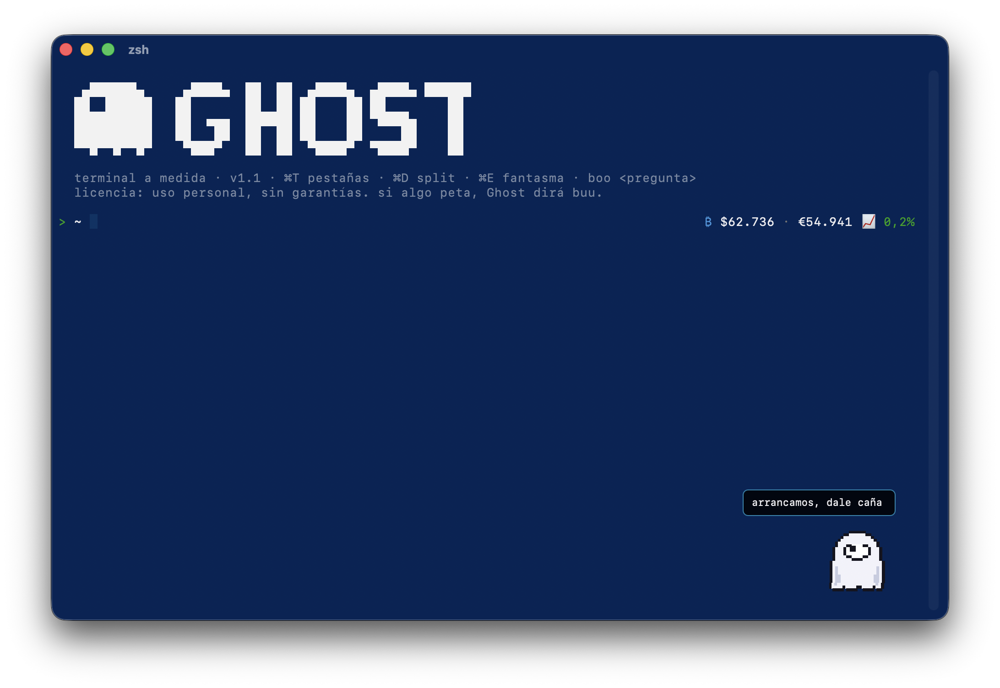

# 👻 Ghost

Terminal nativo para macOS con un fantasma dentro.

Ghost es un emulador de terminal hecho en Swift + AppKit (cero web, cero Electron)
con una mascota pixel art que vive en tu terminal, comenta lo que haces y, si le
das un LLM local, se convierte en copiloto con memoria y manos.



## Qué trae

**Terminal**
- Motor [SwiftTerm](https://github.com/migueldeicaza/SwiftTerm), app nativa (~3 MB)
- Pestañas en sidebar vertical (⌘T): nombre editable con doble click y resumen del último comando
- Splits arrastrables (⌘D): columna izquierda, fila superior, división central doble, o suéltalo fuera y se convierte en ventana
- **Persistencia total**: cierra la app como sea y al reabrir cada terminal recupera su scrollback con colores, su directorio, sus nombres y la memoria de la mascota. Si tenías `claude` corriendo, lo relanza con `--continue` y tu conversación sigue
- 8 temas conmutables en caliente (Hacker, Old School, Cloud, IT, Geek, Apple, Windows, Linux)
- Español e inglés, ajustes en ⌘,
- Scroll reescrito: preciso con trackpad, reenvío de rueda a apps con ratón (htop, claude), flechas en pantalla alternativa, scrollbar propia de dos modos (posición absoluta en shell, palanca en apps a pantalla completa)
- Anti-jiggler: si usas un mueve-ratones, sus meneos no ensucian el input de las apps
- Drag & drop de ficheros (escribe la ruta escapada), menú contextual con extras

**Ghost, la mascota**
- Pixel art con física: cadenas con simulación Verlet que se balancean al arrastrarlo y reposan en el suelo, falda ondulante, parpadeo, pupila que sigue al ratón
- Gestos espontáneos, glitches CRT, y sustos absurdos de vez en cuando ("conocí a un sysadmin que desplegaba los viernes. nadie volvió a verlo")
- Expresiones según el estado: enfado en errores, sueño si le ignoras, paseíllo nervioso con ruedita pixel mientras piensa
- Vive en una terminal concreta: arrástralo a otra y se muda migrando cwd y variables de entorno

**boo, el copiloto (con [LM Studio](https://lmstudio.ai) en localhost:1234)**
- `boo <pregunta>`: responde con el contexto real de tu terminal (directorio, comandos, output en pantalla)
- Memoria conversacional por terminal, persistente; `boo olvida` para resetear
- Los comandos sugeridos salen en un bocadillo propio: un click y solo se copia el comando
- **Acciones**: pídele que organice el escritorio o que busque y abra un documento; genera un script zsh, lo valida contra una lista de patrones peligrosos (jamás borra, solo mueve) y lo ejecuta en tu terminal a la vista
- Avisa de comandos peligrosos antes de que se ejecuten (rm -rf, force push, DROP TABLE...)
- Sin LLM sigue funcionando con reglas: comenta errores, celebra pushes, vigila

## Instalación

1. Baja el DMG de la [última release](../../releases/latest) y arrastra `Ghost.app` a Aplicaciones
2. Primera apertura: **click derecho → Abrir** (la app va firmada ad-hoc, sin notarizar)
3. Opcional: arranca LM Studio con un modelo cargado para darle cerebro a boo

Requiere macOS 13+ (Apple Silicon).

## Compilar desde el código

```zsh
git clone https://github.com/ijuanlux/ghost-terminal.git
cd ghost-terminal
./scripts/make-app.sh   # build release + icono + bundle en /Applications/Ghost.app
```

## Licencia

MIT. Si algo peta, Ghost dirá buu y poco más.
